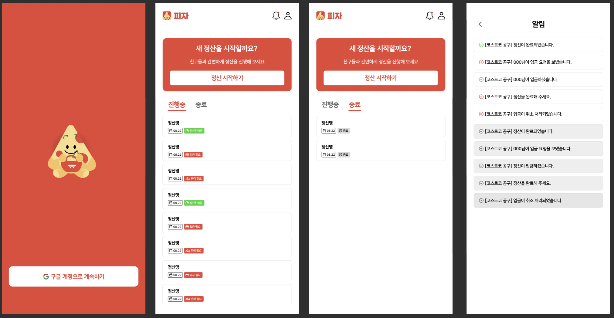
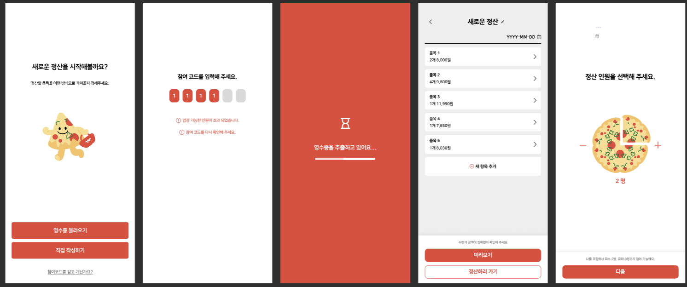
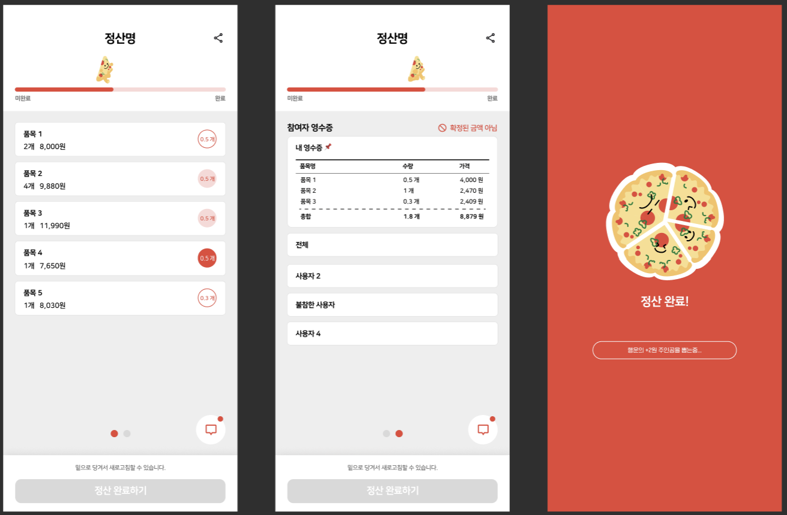
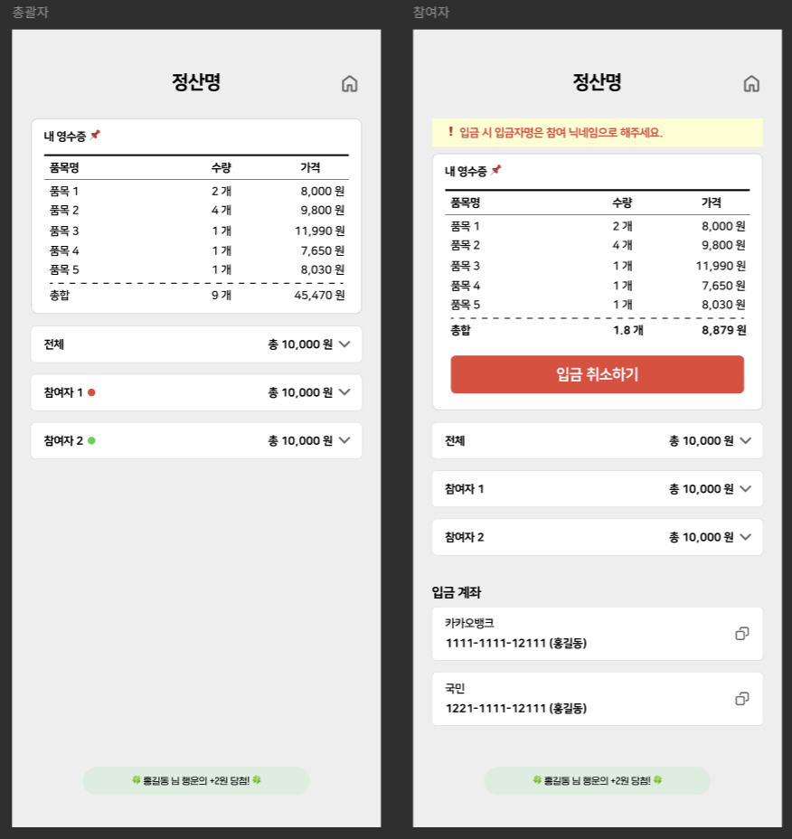

# 청년 세대의 경제적, 사회적 어려움을 해결하기 위한 솔루션, 피자 🍕

## 📌 기획배경

1인 가구 증가와 소비 패턴 변화로 소량 구매가 늘어나고 있지만, 단가 부담은 여전히 큽니다. 공동구매는 비용을 줄이는 좋은 방법이지만, 기존 더치페이는 총액을 인원수로만 나눠 실제 구매 내역과 맞지 않는 경우가 많습니다.

영수증에서 각자의 품목과 금액을 일일이 계산하는 과정도 번거롭고 실수가 잦습니다. 피자는 영수증 OCR을 활용해 품목·가격을 자동으로 인식하고, 참여자는 링크로 접속해 본인이 구매한 항목만 선택하면 됩니다. 시스템이 자동으로 각자의 부담금을 계산·공유하여 빠르고 공정한 정산을 돕습니다.

 
 

## 📌 기능소개

### ✅ 로그인

구글 계정으로 간편 로그인이 가능합니다.

 

### ✅ 정산하기

네이버 클로바 OCR을 통해 영수증을 인식하여 항목과 가격 정보를 자동 추출합니다. 수동으로 편집도 가능합니다.

 

### ✅ 참여하기/공유하기(참여자)

정산 참여 인원을 지정한 후 저장하면, 총괄자는 링크를 통해 정산을 공유할 수 있습니다. 참여자는 앱 설치 없이 접속하여 자신의 몫을 정산할 수 있습니다.

 

### ✅ 정산 관리하기(총괄자)

- 정산 총괄자는 계좌 등록 및 입금 여부를 체크할 수 있습니다. 모든 입금 완료 시 정산을 종료처리할 수 있습니다.

 
 
 
 

<h2>📌 팀원 소개</h2>

<table >
    <tr align="center">
      <td style="min-width: 100px;">
            <a href="https://github.com/whoneykkk">
              
               
              <b>김혜원</b>
            </a>
        </td>
              <td style="min-width: 100px;">
            <a href="https://github.com/yeon17s">
              
               
              <b>박서연</b>
            </a>
        </td>
                </td>
              <td style="min-width: 100px;">
            <a href="https://github.com/hummingbbird">
              
               
              <b>이채영</b>
            </a>
        </td>
      <td style="min-width: 100px;">
            <a href="https://github.com/monikhyun">
              
               
              <b>문익현</b>
            </a>
        </td>
        <td style="min-width: 100px;">
            <a href="https://github.com/parkJJae">
              
               
              <b>박재현</b>
            </a>
        </td>
        <td style="min-width: 100px;">
            <a href="">
              
               
              <b>최명성</b>
            </a>
        </td>
    </tr>
      </td>
       <td align="center">
            PM  
      </td>
       <td align="center">
            Frontend  
      </td>
       <td align="center">
            Frontend  
      </td>
      <td align="center">
            Backend  
      </td>
      <td align="center">
            Backend  
      </td>
      <td align="center">
            Design  
      </td>
    </tr>

</table>

 
 

## 📌 기술 스택

